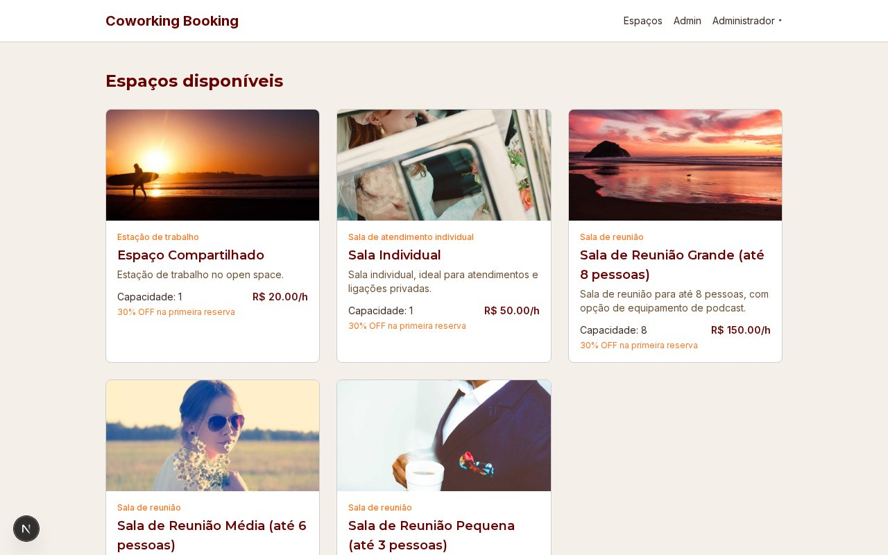
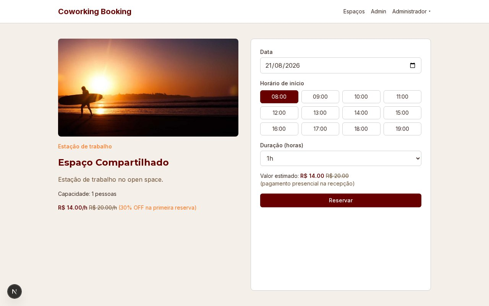
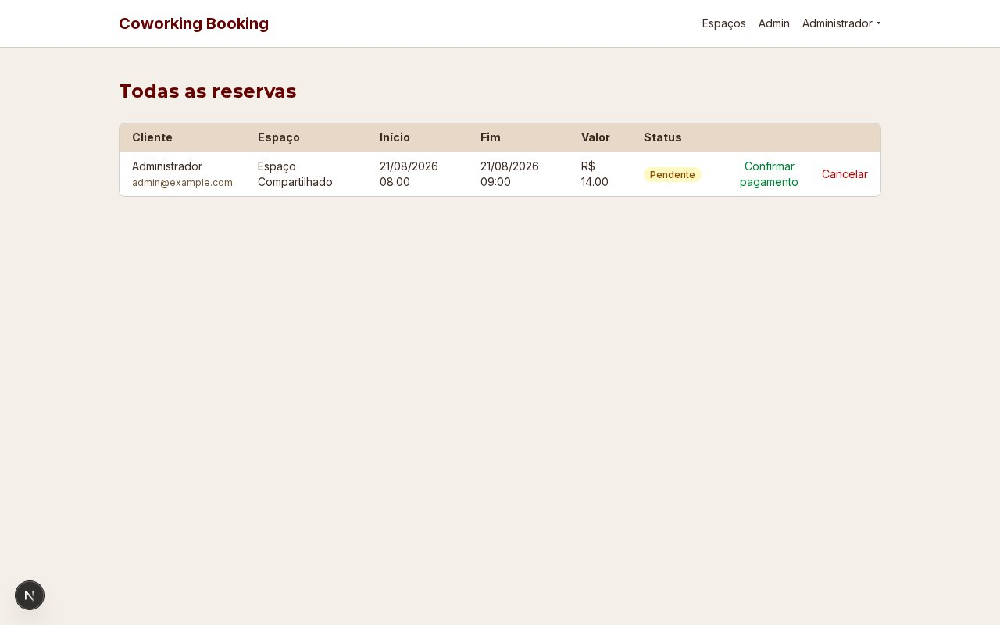

# Coworking Booking — App de Reservas

Sistema completo de reservas para um coworking fictício: clientes reservam salas em tempo real e a
equipe gerencia espaços, reservas e pagamentos por um painel administrativo.



## Funcionalidades

- **Cadastro e login** por e-mail/senha ou Google, com consentimento LGPD explícito no cadastro
- **Reserva em tempo real** por espaço, data e horário, com cálculo automático de preço e do
  desconto de boas-vindas na primeira reserva
- **Prevenção de overbooking**: duas pessoas nunca conseguem reservar o mesmo horário — a checagem
  de conflito roda dentro de uma transação `SERIALIZABLE` do Postgres
- **Minhas Reservas**: histórico do cliente, com cancelamento livre até 24h antes do início
- **Painel administrativo**: CRUD de espaços, confirmação de pagamento presencial e gestão de
  todas as reservas




## Stack técnica

| Camada | Tecnologia |
| --- | --- |
| Framework | Next.js 16 (App Router) + TypeScript |
| Estilo | Tailwind CSS v4 |
| Banco de dados | PostgreSQL via Prisma 7 (`@prisma/adapter-pg`) |
| Autenticação | NextAuth.js v5 (Auth.js) — credenciais com bcrypt + Google OAuth |
| Validação | Zod em toda entrada de Server Action |
| E-mail | Resend |
| Hospedagem | Vercel (app) + Neon (Postgres gerenciado) |

## Destaques de arquitetura

- **Backend e frontend separados por pasta** dentro de um único app Next.js: `src/app/` e
  `src/components/` só cuidam de UI; toda regra de negócio, autenticação e acesso a dados vive em
  `src/backend/` (`services/`, `actions/`, `validations/`, `db/`). O frontend nunca acessa o banco
  diretamente — só via Server Actions.
- **Erros nunca vazam para o usuário**: qualquer exceção não tratada é capturada, logada no
  servidor e convertida numa mensagem genérica — só mensagens de negócio explícitas
  (`SafeActionError`) chegam à tela.
- **Desconto de primeira reserva** recalculado dentro da mesma transação da criação da reserva,
  evitando concessão duplicada em cliques concorrentes.

## Como rodar localmente

```bash
npm install
npx prisma dev -d          # sobe um Postgres local gerenciado pelo Prisma (uma vez só)
npx prisma migrate dev     # aplica o schema
npx prisma db seed         # cria o admin + espaços de exemplo
npm run dev                # http://localhost:3000
```

Login de admin criado pelo seed: `admin@example.com` / `admin123`.

## Roadmap

- Pacotes de horas avulsos e notificações via WhatsApp
- Relatórios de ocupação e receita no painel admin
- Upload real de fotos dos espaços e 2FA para administradores
- Gateway de pagamento online (Pix/cartão)
